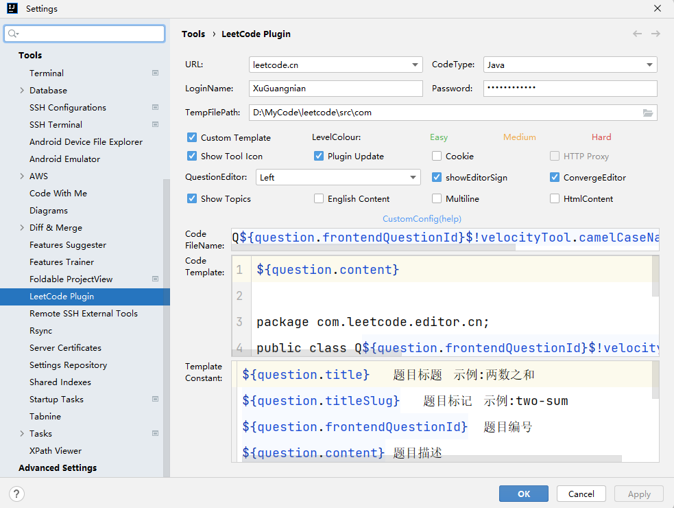
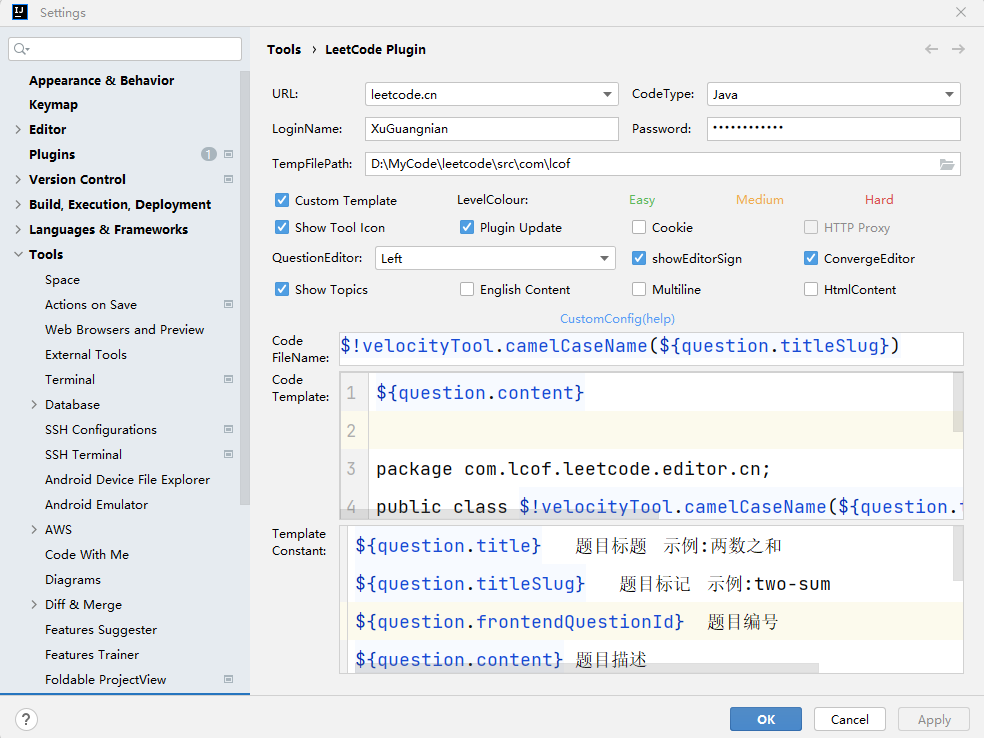

## Plugin: LeetCode Editor

## LeetCode Editor 插件题单配置
### LeetCode 配置

* TempFilePath: `D:\MyCode\leetcode\src\com`
* Code FileName
```
Q${question.frontendQuestionId}$!velocityTool.camelCaseName(${question.titleSlug})
```
* Code Template
```
${question.content}

package com.leetcode.editor.cn;
public class Q${question.frontendQuestionId}$!velocityTool.camelCaseName(${question.titleSlug}) {
    public static void main(String[] args) {
        Solution solution = new Q${question.frontendQuestionId}$!velocityTool.camelCaseName(${question.titleSlug})().new Solution();
    }
${question.code}
}
```
### LCOF(剑指 offer) 配置

* TempFilePath: `D:\MyCode\leetcode\src\com\lcof`
* Code FileName
```
$!velocityTool.camelCaseName(${question.titleSlug})
```
* Code Template
```
${question.content}

package com.lcof.leetcode.editor.cn;
public class $!velocityTool.camelCaseName(${question.titleSlug}) {
    public static void main(String[] args) {
        Solution solution = new $!velocityTool.camelCaseName(${question.titleSlug})().new Solution();
    }
    ${question.code}
}
```
### LCCI(程序员面试金典) 配置
* TempFilePath: `D:\MyCode\leetcode\src\com\lcci`
* Code FileName
```
$!velocityTool.camelCaseName(${question.titleSlug})
```
* Code Template
```
${question.content}

package com.lcci.leetcode.editor.cn;
public class $!velocityTool.camelCaseName(${question.titleSlug}) {
    public static void main(String[] args) {
        Solution solution = new $!velocityTool.camelCaseName(${question.titleSlug})().new Solution();
    }
    ${question.code}
}
```